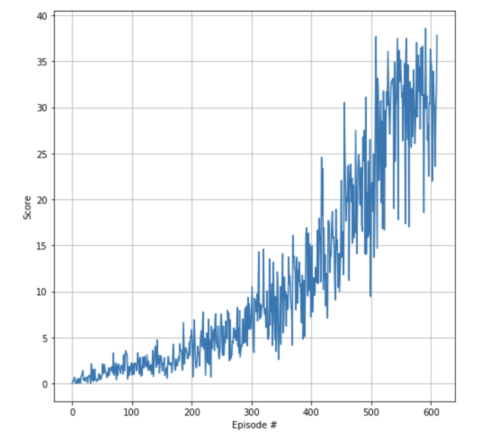

# Summary

In this project I implemeted an agent (a double-joint arm) that can move to the target location. 
Reward of +0.1 is provided for each step that the agent's hand is in the goal location.
To solve the task the agent must get an average score of +30 (over the last 100 episodes).

# Implementation 
## Algorithm
This project utilised the `DDPG` (Deep Deterministic Policy Gradient) architecture outlined in the 
[DDPG-Bipedal Udacity project repo](https://github.com/udacity/deep-reinforcement-learning/tree/master/ddpg-bipedal).

The `DDPG` algorithm is implemented in the [agent.py](agent.py) file. Learning of continuous actions requires an actor and a 
critic model. The models for `Actor` and `Critic` are implemented in the [networks.py](networks.py).

The actor model learns to predict an action vector while the critic model 
learns Q values for state-action pairs. DDPG uses experience replay buffer to sample batches of uncorrelated 
experiences to train on. This buffer is implemented in the [replay_buffer.py](replay_buffer.py).
It also distinguishes between online and target models for both actor and critic, similar to 
fixed Q-targets and double DQN technique. Online models are updated by minimizing loses while target models are updated
through soft update, i.e. online model parameters values are partially transferred to target models. This helps to avoid 
overestimation of Q-values and makes the training more stable.

The core of DDPG algorithm is implemented in the Agent class. The act method generates an action for the given state with the 
online actor model. An important aspect is the noise added to the actions to allow exploration of the the action space. The 
noise is generated through the `Ornstein–Uhlenbeck` process, which is a stochastic process that is both Gaussian and Markov, 
drifting towards the mean in long-term. This code of `Ornstein–Uhlenbeck` process can be found n the [noise.py](noise.py).

## Architectures

### Actor Network 

1. State input (33 units)
2. Hidden layer (128 units) with ReLU activation and batch normalization
3. Hidden layer (128 units) with ReLU activation and batch normalization
4. Action output (4 units) with tanh activation

### Critic Network 

1. State input (33 units)
2. Hidden layer (128 nodes) with ReLU activation and batch normalization
3. Action input (4 units)
4. Hidden layer with inputs from layers 2 and 3 (128 nodes) with ReLU activation and batch normalization
5. Q-value output (1 node)

### Hyperparameters

Almost all the hyperparameters are defined in the [constants.py](constants.py):

 Hyperparameter | Value | Description |
|---|---:|---|
| Replay buffer size | 1e5 | Maximum size of experience replay buffer |
| Replay batch size | 128 | Number of experiences sampled in one batch |
| Actor hidden units | 128, 128 | Number of units in hidden layers of the actor model |
| Critic hidden units | 128, 128 | Number of units in hidden layers of the critic model |
| Actor learning rate | 1e-3 | Controls parameters update of the online actor model |
| Critic learning rate | 1e-3 | Controls parameters update of the online critic model |
| Target update mix | 1e-3 | Controls parameters update of the target actor and critic models |
| Update every N steps | 20 | The target model will be soft update every N steps.
| Discount factor | 0.99 | Discount rate for future rewards |
| Ornstein-Uhlenbeck, mu | 0 | Mean of the stochastic  process|
| Ornstein-Uhlenbeck, theta | 0.15 | Parameter of the stochastic process |
| Ornstein-Uhlenbeck, sigma | 0.2 | Standard deviation of the stochastic process |
| Max episodes | 1000 | Maximum number of episodes to train |
| Max steps | 1e3 | Maximum number of timesteps per episode |


## Results



```
Episode 100	Average Score: 1.09
Episode 200	Average Score: 2.44
Episode 300	Average Score: 4.89
Episode 400	Average Score: 9.29
Episode 500	Average Score: 17.02
Episode 600	Average Score: 29.26

Environment solved in 511 episodes!	Average Score: 30.09

Total time took for training: 41.06 min.
 ```
## Possible extensions

- [Prioritized Experience Replay](https://arxiv.org/abs/1511.05952)
- [Asynchronous Actor Critic](https://medium.com/emergent-future/simple-reinforcement-learning-with-tensorflow-part-8-asynchronous-actor-critic-agents-a3c-c88f72a5e9f2)
